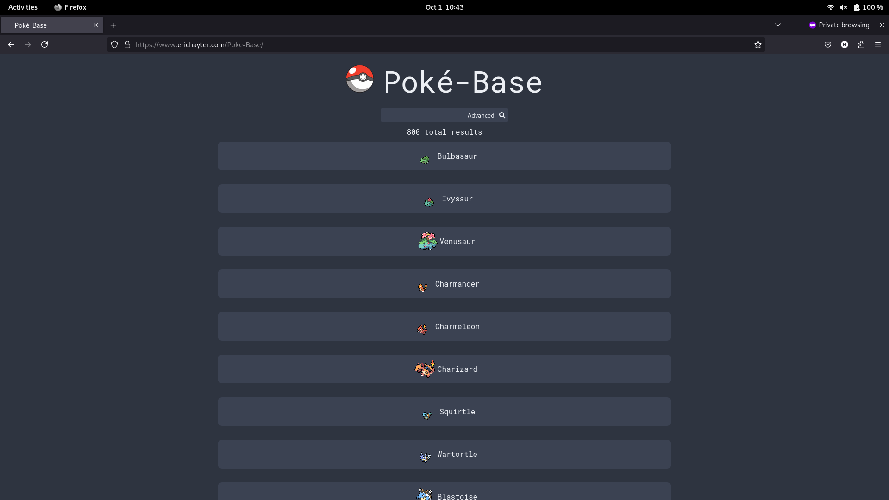
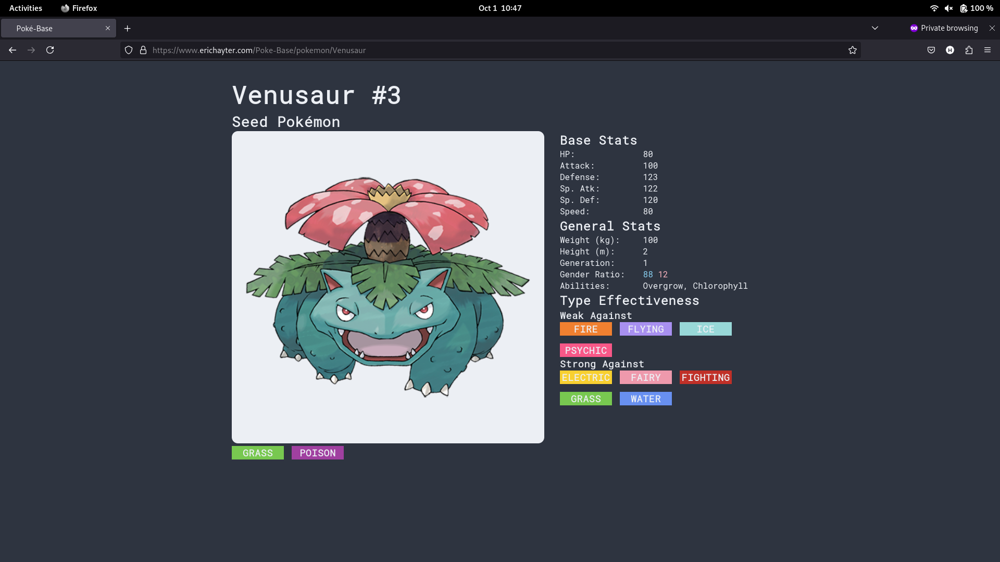

# Poké-Base

This is a small javascript project that I made using react. 
It's a simple catalogue of data for pokemon and allows users to make specific queries on type, legendary status, and name. 
Check out the project [here](https://www.erichayter.com/Poke-Base/)!

*homepage of website*

*landing page for pokemon*
